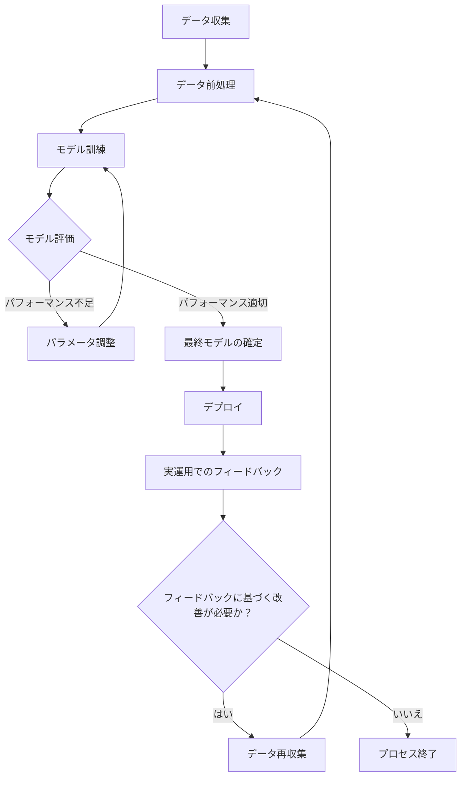

```mermaid
graph TD;
    A[データ収集] --> B[データ前処理]
    B --> C[モデル訓練]
    C --> D{モデル評価}
    D -- パフォーマンス不足 --> E[パラメータ調整]
    E --> C
    D -- パフォーマンス適切 --> F[最終モデルの確定]
    F --> G[デプロイ]
    G --> H[実運用でのフィードバック]
    H --> I{フィードバックに基づく改善が必要か？}
    I -- はい --> J[データ再収集]
    J --> B
    I -- いいえ --> K[プロセス終了]

``` 

